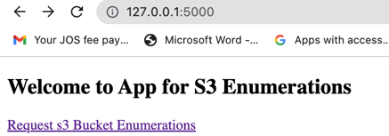
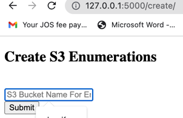
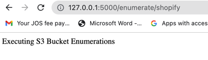
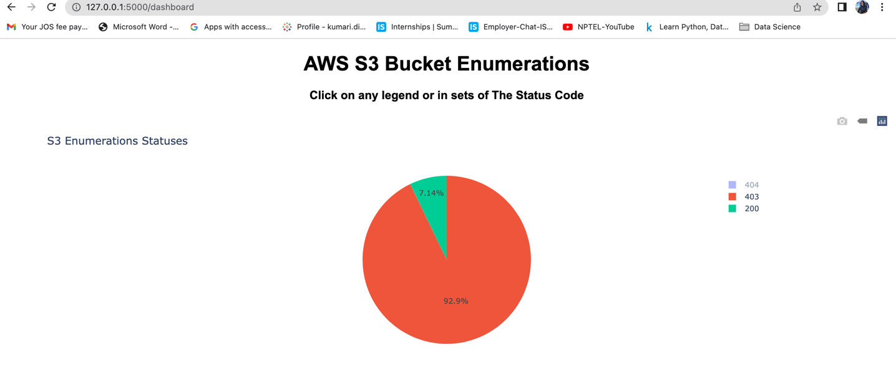

# AWS_S3_Enumerations

## About
A Python Web based tool to enumerate AWS S3 buckets using different permutations

## Installation
After cloning the repository and navigating to the created folder, simply run:
```bash
pip install -r requirements.txt
```

## Usage
```bash

python s3enumerations.py --help

usage: s3enumerations.py [-h] [-p PREFIXES] [-l LIMIT] [-u USER_AGENT] target

Bruteforce AWS s3 buckets using different permutations

positional arguments:
  target                which target to scan

```
## To Run As Flask (Quart) Application on localhost:5000 follow below steps :-

1. clone in the github repo in Pycharm and run s3enumerations.py file.
2. Hit http://127.0.0.1:5000/     On the Browser.
3. 
4. Click on Request s3 Bucket Enumerations It will call create request page as below :-
5. 
6. Enter the domain or entry for the s3 bucket enumerations.
7. After submit It will start the enumerations.
8. 
9. It will take some time to process and after certain time period refer the URL as below :-
10. http://127.0.0.1:5000/dashboard
11. 
12. This is give the dashboard for the s3 bucket enumerations done and written in the directory in secureu_output.txt file on the Web Console.


